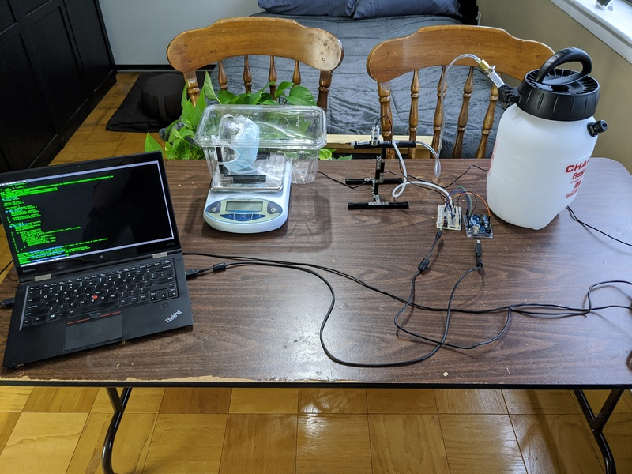
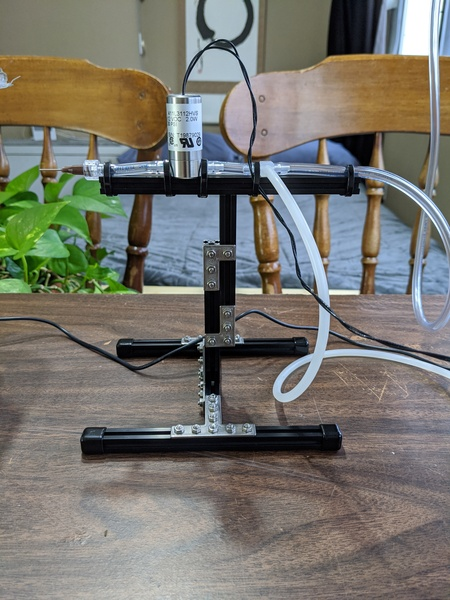
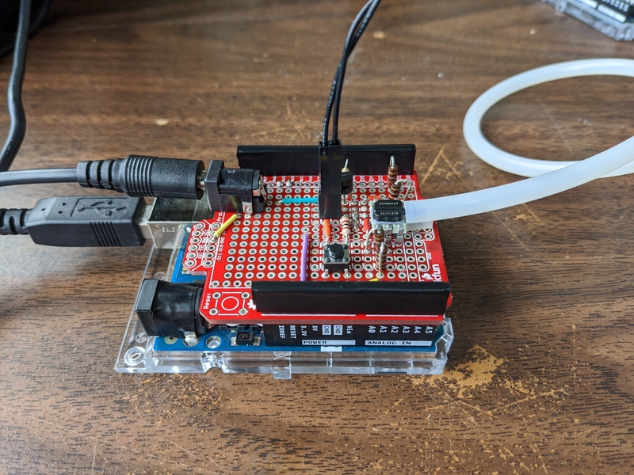
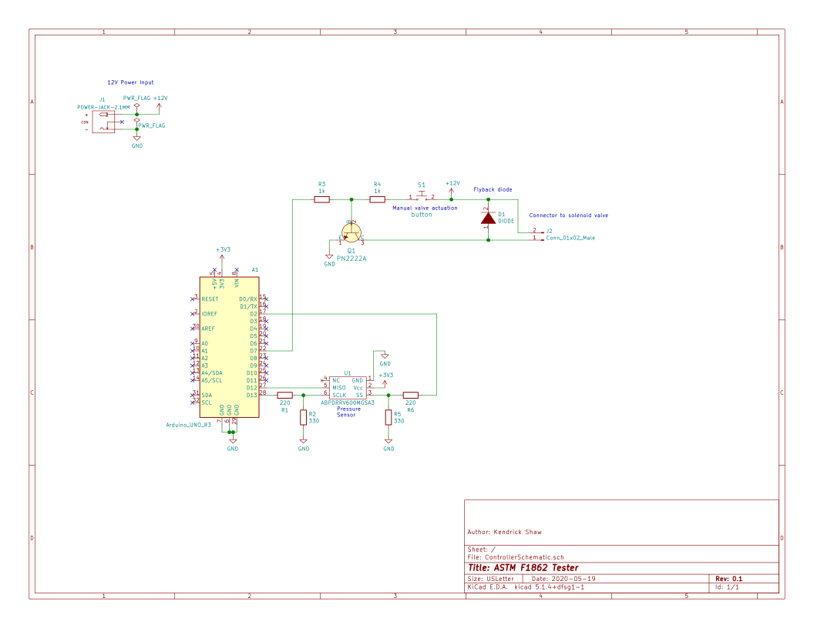

# ASTM F1862 Tester

This repository contains an abbreviated description of a device for testing
surgical masks for their resistance to penetration by synthetic blood as
described in the ASTM F1862 standard.  Included is a bill of materials, Arduino
firmware, and a Linux console-mode python script for controlling the device.
This repository is not intended to be a complete how-to for building this
device, but may be a useful reference for others building similar devices.

## Photos

## Brief functional description

The device is designed to deliver a consistent volume of synthetic blood at a
consistent pressure through an 18 gage catheter. The synthetic blood is first
placed in a beaker that is then placed in a pressure vessel (converted from a
chemical sprayer).  It then flows through a siphon and out through a piece of
soft PVC tubing, then through a solenoid controlled valve, and finally out a
stainless steel catheter.  A side port right before the valve is used to
measure the pressure in the pressure chamber.  The valve and the pressure
chamber are both controlled by an Arduino.  The Arduino is, in turn, controlled
by a python script which allows for monitoring of the pressure, setting of
valve actuation times, and triggering of actuation of the valve.

The mask itself is placed on a stand inside of a plastic chamber which serves
as a splash guard.  The container is in turn placed on a laboratory balance
which allows for precise calibration of the amount of synthetic blood
delivered.
